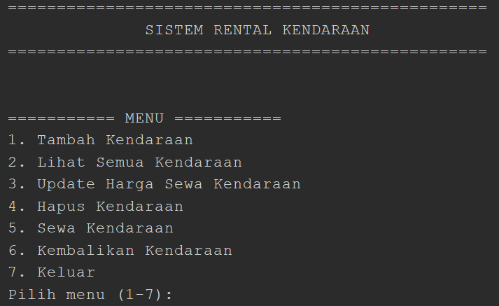
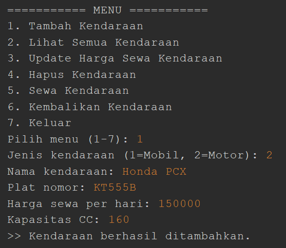
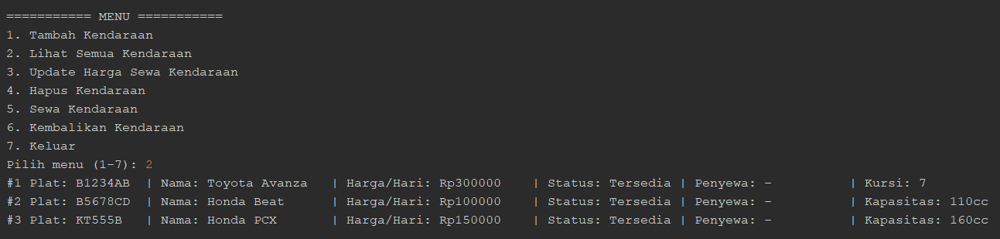
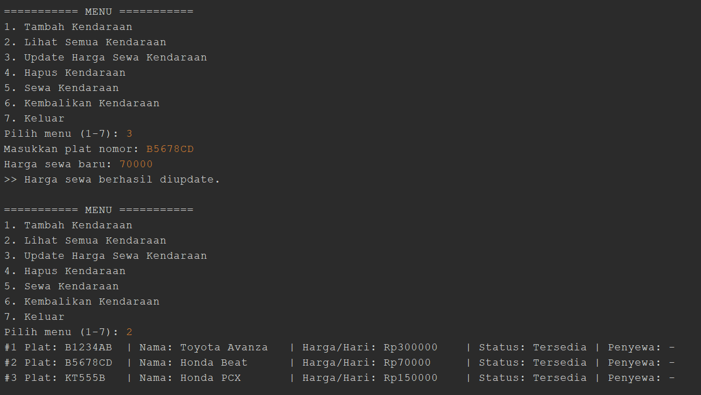
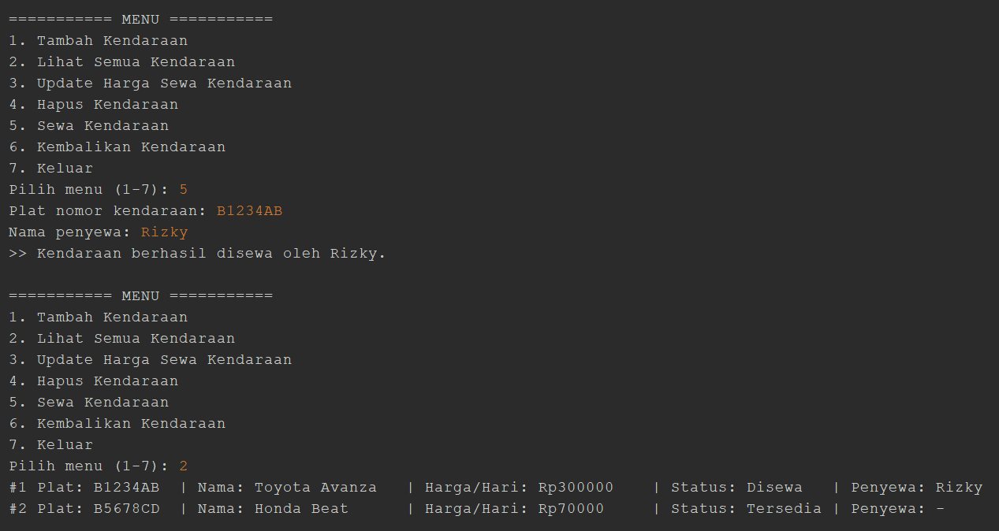
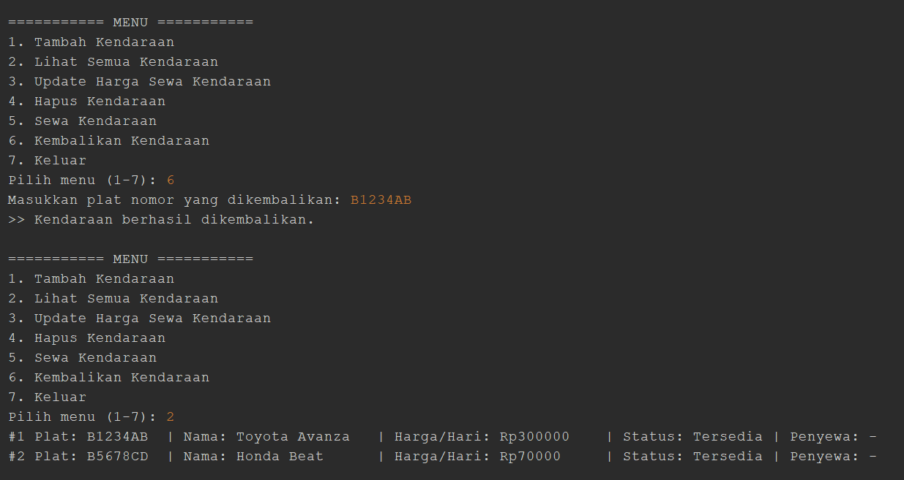
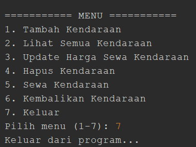

# Sistem Rental Kendaraan — Tugas PBO

## 📌 Identitas
- **Nama** : Rivalio Chendra
- **NIM**  : 2509116039
- **Mata Kuliah** : Pemrograman Berorientasi Objek
- **Kelas** : A

---

## 📖 Deskripsi Studi Kasus

Program ini adalah program Sistem Rental Kendaraan berbasis Command Line Interface (CLI) yang dibuat menggunakan bahasa pemrograman Java.

Program ini mensimulasikan proses bisnis rental kendaraan sederhana, di mana admin dapat:
- Mengelola data kendaraan (tambah, lihat, ubah harga, hapus)
- Menyewakan kendaraan kepada penyewa
- Mengembalikan kendaraan yang sudah selesai disewa


---

## 🗂️ Struktur Project

```text
RentalKendaraan/
├── src/
│   ├── com.mycompany.rentalkendaraan/
│   │   └── RentalKendaraan.java (main program)
│   │
│   └── model/
│       ├── Kendaraan.java (superclass)
│       ├── Mobil.java     (subclass)
│       └── Motor.java     (subclass)
```


---

## 🧩 Hierarki Class
```text
                    ┌──────────────────────────┐
                    │ Kendaraan (Superclass)   │
                    ├──────────────────────────┤
                    │ - namaKendaraan          │
                    │ - platNomor              │
                    │ - hargaSewaPerHari       │
                    │ - status                 │
                    │ - namaPenyewa            │
                    └────────────┬─────────────┘
                                 │
                    ┌────────────┴─────────────┐
                    │                          │
                 extends                    extends
                    │                          │
          ┌─────────┴─────────┐      ┌─────────┴────────┐
          │ Mobil (Subclass)  │      │ Motor (Subclass) │
          ├───────────────────┤      ├──────────────────┤
          │ - jumlahKursi     │      │ - kapasitasCC    │
          └───────────────────┘      └──────────────────┘
```

**Penjelasan hubungan IS-A:**
- `Mobil` **IS-A** `Kendaraan` (Mobil adalah sebuah Kendaraan)
- `Motor` **IS-A** `Kendaraan` (Motor adalah sebuah Kendaraan)

Kedua subclass ini mewarisi seluruh atribut umum (`namaKendaraan`, `platNomor`, `hargaSewaPerHari`, `status`, `namaPenyewa`) dan method (`tampilkanInfo()`, `sewa()`, `kembalikan()`) dari superclass `Kendaraan`, tanpa perlu menulis ulang kode yang sama.

---

## 🔑 Penerapan Inheritance dalam Kode

### 1. Superclass `Kendaraan`
```java
public class Kendaraan {
    protected String namaKendaraan;
    protected String platNomor;
    protected double hargaSewaPerHari;
    protected String status;
    protected String namaPenyewa;

    public Kendaraan(String namaKendaraan, String platNomor, double hargaSewaPerHari) {
        this.namaKendaraan = namaKendaraan;
        this.platNomor = platNomor;
        setHargaSewaPerHari(hargaSewaPerHari);
        this.status = "Tersedia";
        this.namaPenyewa = "-";
    }
    // ... method umum: tampilkanInfo(), sewa(), kembalikan(), dst.
}
```
Atribut menggunakan modifier `protected` supaya bisa diakses langsung oleh subclass (`Mobil` dan `Motor`), tapi tetap tertutup dari kelas luar yang tidak berelasi.

### 2. Subclass `Mobil` dan `Motor`
```java
public class Mobil extends Kendaraan {
    private int jumlahKursi;

    public Mobil(String namaKendaraan, String platNomor, double hargaSewaPerHari, int jumlahKursi) {
        super(namaKendaraan, platNomor, hargaSewaPerHari); // memanggil constructor superclass
        this.jumlahKursi = jumlahKursi;
    }

    public void tampilkanInfoMobil() {
        super.tampilkanInfo(); // memanggil method milik superclass
        System.out.printf("| Kursi: %d\n", jumlahKursi);
    }
}
```
- Kata kunci **`extends`** digunakan untuk mewariskan seluruh atribut dan method dari `Kendaraan` ke `Mobil`/`Motor`.
- Kata kunci **`super(...)`** dipanggil di baris pertama constructor untuk menginisialisasi bagian data yang dimiliki superclass.
- Kata kunci **`super.tampilkanInfo()`** digunakan untuk memanggil method umum milik superclass, lalu subclass menambahkan informasi spesifiknya sendiri (jumlah kursi / kapasitas CC).

---

## ⚙️ Fitur Program

| No | Fitur | Keterangan |
|----|-------|------------|
| 1 | Tambah Kendaraan | Menambahkan data Mobil atau Motor baru |
| 2 | Lihat Semua Kendaraan | Menampilkan seluruh data kendaraan beserta status |
| 3 | Update Harga Sewa | Mengubah harga sewa per hari sebuah kendaraan |
| 4 | Hapus Kendaraan | Menghapus data kendaraan dari daftar |
| 5 | Sewa Kendaraan | Menyewakan kendaraan ke penyewa tertentu |
| 6 | Kembalikan Kendaraan | Mengembalikan status kendaraan menjadi tersedia |

---

## 🖼️ Dokumentasi Program (Screenshot & Penjelasan)

Berikut adalah dokumentasi hasil pengujian program beserta penjelasan dari setiap tahapan yang dijalankan.

### 1. Tampilan Menu Utama



Gambar di atas menunjukkan tampilan awal program saat pertama kali dijalankan. Program menampilkan judul aplikasi beserta daftar menu yang dapat dipilih oleh pengguna, mulai dari menambah data kendaraan hingga keluar dari program. Pada tahap ini, sistem juga telah memuat dua data kendaraan awal (Toyota Avanza dan Honda Beat) sebagai contoh data yang tersedia secara *default*.

---

### 2. Menambah Data Kendaraan



Gambar ini menampilkan proses penambahan data kendaraan baru melalui menu nomor 1. Pengguna diminta memasukkan jenis kendaraan (Mobil atau Motor), lalu mengisi data seperti nama kendaraan, plat nomor, harga sewa per hari, dan atribut spesifik sesuai jenisnya (jumlah kursi untuk Mobil, kapasitas CC untuk Motor). Setelah data berhasil diinput, program menampilkan pesan konfirmasi bahwa kendaraan baru telah berhasil ditambahkan ke dalam daftar.

---

### 3. Menampilkan Seluruh Data Kendaraan



Gambar ini memperlihatkan hasil dari menu nomor 2, yaitu daftar seluruh kendaraan yang tersimpan dalam sistem. Setiap baris menampilkan informasi lengkap kendaraan, meliputi plat nomor, nama kendaraan, harga sewa per hari, status ketersediaan (Tersedia/Disewa), serta nama penyewa jika kendaraan sedang disewa. Bagian ini membuktikan bahwa method `tampilkanInfoMobil()` dan `tampilkanInfoMotor()` berjalan dengan benar, termasuk pemanggilan `super.tampilkanInfo()` dari superclass `Kendaraan`. Dapat dilihat bahwa Honda PCX yang sebelumnya saya buat terlihat pada bagian ini.

---

### 4. Mengubah Harga Sewa Kendaraan



Gambar ini menunjukkan proses pembaruan data melalui menu nomor 3. Pengguna memasukkan plat nomor kendaraan yang ingin diubah harganya, kemudian memasukkan nilai harga sewa yang baru. Program akan memvalidasi input tersebut (harga tidak boleh bernilai negatif) sebelum memperbarui data dan menampilkan pesan bahwa harga sewa telah berhasil diperbarui.

---

### 5. Menghapus Data Kendaraan


Gambar ini menampilkan proses penghapusan data melalui menu nomor 4. Pengguna memasukkan plat nomor kendaraan yang ingin dihapus, kemudian program mencari data tersebut dalam daftar dan menghapusnya jika ditemukan. Apabila plat nomor yang dimasukkan tidak terdaftar, program akan menampilkan pesan bahwa data tidak ditemukan.

---

### 6. Menyewa Kendaraan



Gambar ini memperlihatkan proses penyewaan kendaraan melalui menu nomor 5. Pengguna memasukkan plat nomor kendaraan yang ingin disewa beserta nama penyewa. Program terlebih dahulu memeriksa status kendaraan tersebut; apabila masih berstatus "Tersedia", maka status akan diubah menjadi "Disewa" dan nama penyewa akan tercatat pada data kendaraan tersebut.

---

### 7. Mengembalikan Kendaraan



Gambar ini menunjukkan proses pengembalian kendaraan melalui menu nomor 6. Setelah pengguna memasukkan plat nomor kendaraan yang dikembalikan, program akan memeriksa apakah kendaraan tersebut sedang berstatus "Disewa". Jika benar, status kendaraan akan dikembalikan menjadi "Tersedia" dan data nama penyewa akan dihapus (direset), menandakan kendaraan tersebut sudah dapat disewa kembali oleh penyewa lain.

---

### 8. Keluar dari Program



Gambar ini memperlihatkan output yang keluar jika user memilih opsi ke 7.
